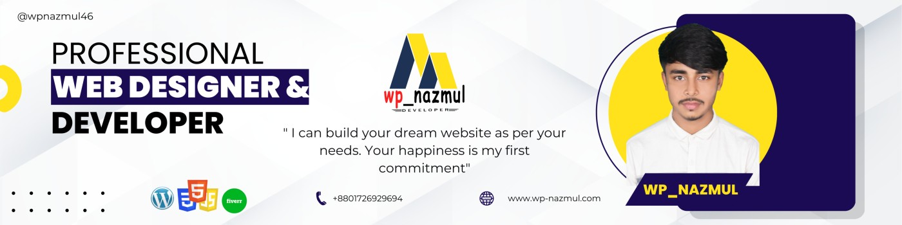
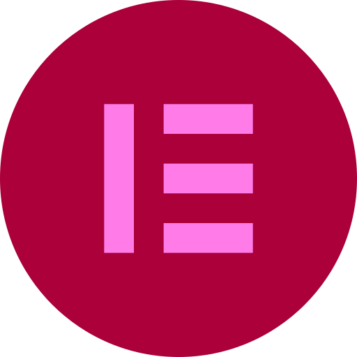

<!-- Links section starts here -->

[website]: http://www.wpnazmul.xyz/
[youtube]: https://www.youtube.com/c/anisulislamrubel
[facebook]: https://www.facebook.com/wpnazmul94/
[linkedin]: https://www.linkedin.com/in/wpnazmul520/
[twitter]: https://github.com/wpnazmul

<!-- banner image Area Start  -->

<!-- banner image Area End  -->

<h1>Hello, I'm Nazmul Hossain</h1>
WordPress Web Designer & Developer | Elementor And WooCommerce Expert | Wix and Shopify I Squarespace & Future Software Engineer

🏠 &nbsp; Living: Mohammadpur , Dhaka

<!-- Contact me section Area start  -->

[][website]
[][youtube]
[][facebook]
[][linkedin]
[][twitter]
 
 

<!-- Contact me section Area ends  -->

<!-- about-me section Area start  -->

##  &nbsp; About Me

I'm Nazmul Hossain. I'm a Professional Web Designer & Developer, Seo, WordPress and WooCommerce Expert. I try my best to make sure of 100% client satisfaction.

 
<!-- about-me section ends here  -->

<!-- web related skills section start  -->
## 👨🏽‍💻 &nbsp; My Skills :

### Front-End :

 
 

### Back-End:

 
 

### Programming Language :

 
 

### Key Skills on CMS :

 
 

<!-- web related skills section ends   -->

<!-- github stats Start  -->

 
 

<!-- github stats ends   -->

<!-- education section start  -->

### 👨🏻‍🎓 &nbsp; Education

1. B.Sc. in Computer Science & Engineering 
   Alhaz Mockbul Hossain University College   
   Mohammadpur, Dhaka.

2.  Higher Secondary School Certificate  
   Kazipur Govt. Mansur Ali College   
   Kazipur, Sirajganj.

 

<!-- education section ends   -->

<!-- languages section start -->

### Languages:

- 🇧🇩 Bangla : Native
- 🏴󠁧󠁢󠁥󠁮󠁧󠁿 English : Native

   

<!-- languages section ends   -->

<!-- sports and game section start  -->

### Sports / Game / Activities / Hobby:

- 🏏 Cricket, ⚽ Football, 🏸 Badminton, 🏐 Volleyball
- 🏊‍♂️ Swimming, 🚶‍♂️ Walking
- ✈️ Travelling 
 

<!-- sports and games section ends   -->
### Why hire me:
🔴 Quick Contact (24/7)  
🔴 Unlimited Revisions until you're satisfied  
🔴 60 days support after-sales service 
🔴100% customizable & manageable design 

---

Thanks for going through my Portfolio.  
All rights reserved by Nazmul hossain @2024

